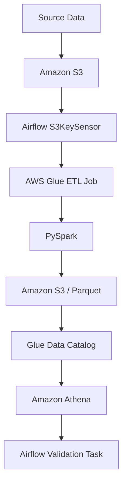

# Data Engineering Study

Python / AWS / Apache Airflow を使用して、データエンジニアリングの基礎から
クラウド上のデータパイプライン構築までを段階的に学習するためのリポジトリです。

CSVを利用したローカルETLから始め、
Parquet、Amazon S3、AWS Glue、Amazon Athena、Apache Spark / PySpark、
Apache Airflowを利用したワークフローオーケストレーションまで実装しています。

現在は、Airflowを中心に

**S3 → AWS Glue → Athena**

を連携したデータパイプラインまで構築しています。

## Architecture

現在の主なデータパイプラインは以下の構成です。



---

## Tech Stack

### Language
- Python 3.12
### Data Processing
- pandas
- PyArrow
- Apache Spark
- PySpark
### Database
- PostgreSQL 16
### AWS
- Amazon S3
- AWS Glue Data Catalog
- AWS Glue ETL
- Amazon Athena
- AWS IAM
- boto3
### Workflow Orchestration
- Apache Airflow 3
### Development / Infrastructure
- Docker
- Docker Compose
- pytest
- Git / GitHub

## Repository Structure
```
data-engineering-study/
├── airflow/
│   └── dags/
│       ├── matches_etl_dag.py
│       ├── matches_glue_dag.py
│       └── matches_pipeline_dag.py
│
├── benchmarks/
│   ├── benchmark_prepare.py
│   └── benchmark_read.py
│
├── data/
│   ├── raw/
│   └── processed/
│
├── docker/
│   ├── airflow/
│   │   ├── Dockerfile
│   │   └── docker-compose.yaml
│   │
│   └── postgres/
│       └── compose.yaml
│
├── examples/
│
├── infra/
│   └── iam/
│       └── glue-data-engineering-policy.json
│
├── jobs/
│   └── glue/
│       └── matches_summary.py
│
├── scripts/
│   └── aws/
│
├── sql/
│   └── 001_create_matches.sql
│
├── src/
│   └── data_engineering_study/
│       ├── config.py
│       │
│       ├── extract/
│       │   └── matches.py
│       │
│       ├── transform/
│       │   └── matches.py
│       │
│       └── load/
│           ├── matches.py
│           ├── parquet.py
│           └── s3.py
│
├── tests/
│
├── .gitignore
├── pyproject.toml
└── README.md
```

### Directory Roles

| Directory     | Purpose                       |
| ------------- | ----------------------------- |
| `src/`        | 再利用可能なPythonアプリケーションコード       |
| `scripts/`    | ローカルやAWS向けの実行スクリプト            |
| `jobs/`       | AWS Glueなど外部実行環境で動作するJob      |
| `airflow/`    | Airflow DAG                   |
| `benchmarks/` | CSV / Parquetなどの性能検証          |
| `examples/`   | ライブラリ・Spark等の学習用コード           |
| `docker/`     | PostgreSQL / Airflowのローカル実行環境 |
| `infra/`      | IAMなどAWSインフラ設定                |
| `sql/`        | PostgreSQL用DDL                |
| `tests/`      | pytestによる自動テスト                |
| `data/`       | ローカル学習用データ                    |


## Setup

### Python

Python 3.12を使用します。
```
python3.12 -m venv .venv
source .venv/bin/activate
```

プロジェクトをeditable installします。
```
pip install -e .
```

これにより、各スクリプトやテストから以下の形式でプロジェクトコードをimportできます。

```
from data_engineering_study.transform.matches import transform_matches
```

### PostgreSQL

ローカルのPostgreSQLはDocker Composeで起動します。
```
cd docker/postgres

docker compose up -d
```

停止：
```
docker compose stop
```

### Apache Airflow
AirflowもDocker Composeで起動します。

```
cd docker/airflow

docker compose up -d
```

Airflow UI：

```
http://localhost:8080
```

停止：
```
docker compose stop
```

### AWS Authentication
ローカル環境からAWSへアクセスする際はAWS CLIで認証します。
```
aws login
```

認証確認：
```
aws sts get-caller-identity
```

AWSの認証情報や `.env` などの秘密情報はGit管理対象外としています。

## Tests

Unit Testにはpytestを使用しています。

プロジェクトルートで実行します。
```
pytest -q
```

主に以下をテストしています。
- Transform処理
- データValidation
- Parquet出力
- S3 Upload
- boto3 ClientのMock

## Learning Progress
| Phase | Topic                                            | Status |
| ----- | ------------------------------------------------ | :----: |
| 1-4   | ETL / PostgreSQL / Validation / Test             |    ✅   |
| 5-7   | Parquet / Columnar Storage / Partition / Pruning |    ✅   |
| 8-11  | Amazon S3 / boto3 / Data Lake / DI               |    ✅   |
| 12    | Glue Data Catalog / Amazon Athena                |    ✅   |
| 13    | AWS Glue ETL / PySpark                           |    ✅   |
| 14    | Apache Airflow                                   |    ✅   |
| 15    | Airflow → AWS Glue                               |    ✅   |
| 16    | Airflow → S3 → Glue → Athena                     |    ✅   |

## Notes

このリポジトリはデータエンジニアリング技術の学習を目的としたものです。

ローカル環境ではDocker ComposeやローカルのAWS認証情報を利用していますが、本番環境ではIAM Role、マネージドな実行環境、Secret管理などを利用する構成が想定されます。


### このREADMEで意識していること

今回、**フェーズ1〜16をREADMEの主役にはしていません**。

READMEの主役は、

```text
何のリポジトリ？
    ↓
どんな構成？
    ↓
どういうデータフロー？
    ↓
何の技術を使ってる？
    ↓
どう実行する？
```


