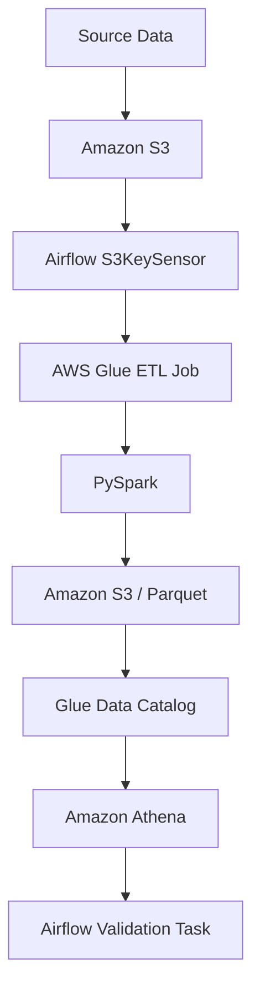
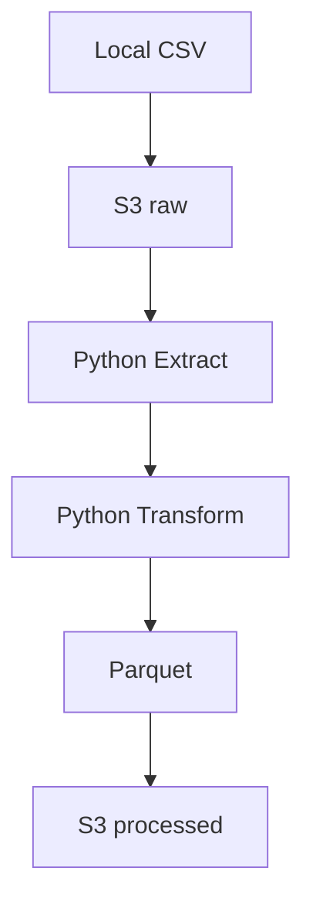
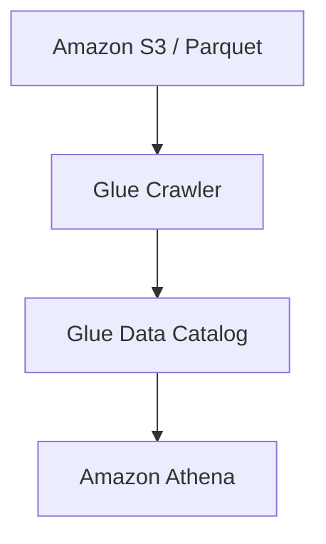
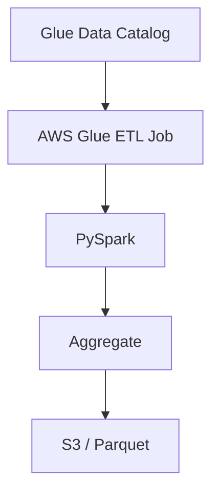
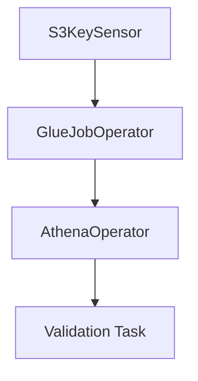
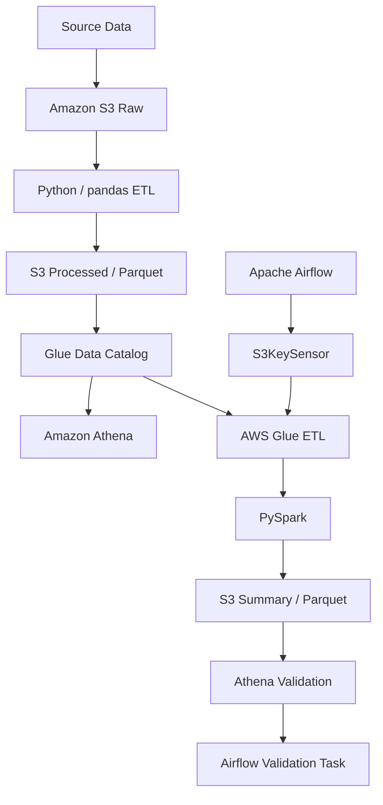

# Architecture

このドキュメントでは、`data-engineering-study` で構築している
データパイプラインの構成と、各コンポーネントの役割を説明します。

---

## Overview

このプロジェクトでは、ローカルでの基本的なETL処理から始め、
Amazon S3、AWS Glue、Amazon Athena、Apache Airflowを組み合わせた
クラウドベースのデータパイプラインまで段階的に構築しています。

現在の主要なパイプラインは以下の構成です。



---

# Local ETL Architecture

最初の構成では、CSVデータをローカル環境で処理し、
PostgreSQLへロードします。

```text
CSV
 ↓
Extract
 ↓
Transform
 ↓
Load
 ↓
PostgreSQL
```

処理は以下の責務に分割しています。

### Extract

CSVなどの入力データを読み込みます。

### Transform

読み込んだデータに対して、

- 必須項目の確認
- データ型変換
- 重複チェック
- 数値チェック
- seasonの生成

などのデータ変換・Validationを実施します。

### Load

変換済みデータをPostgreSQLへ保存します。

UPSERTを利用することで、
同じデータを複数回実行しても結果が重複しない
冪等な処理を意識しています。

---

# Parquet Architecture

CSVデータをParquetへ変換し、
Columnar StorageとPartitionを利用します。

```text
CSV
 ↓
pandas
 ↓
Parquet
 ↓
season=YYYY/
```

S3上では以下のようなHive形式のPartition構成を使用しています。

```text
processed/
└── python-pipeline/
    └── matches/
        ├── season=2022/
        │   └── matches.parquet
        ├── season=2023/
        │   └── matches.parquet
        ├── season=2024/
        │   └── matches.parquet
        ├── season=2025/
        │   └── matches.parquet
        └── season=2026/
            └── matches.parquet
```

`season` はParquetファイル本体には保持せず、
Partition Pathから取得する設計としています。

これにより、AthenaなどのQuery Engineから
Partition Pruningを利用できます。

---

# S3 Data Lake Architecture

ローカルの処理をAmazon S3へ拡張し、
S3をデータレイクとして使用しています。



S3では大きく、

```text
raw
processed
```

の領域を分離しています。

### raw

加工前の入力データを保存します。

### processed

ETL処理後のParquetなど、
分析や後続処理に利用するデータを保存します。

---

# Glue Data Catalog / Athena Architecture

S3に保存されたParquetを
AWS Glue Data Catalogへ登録します。



Glue Data Catalogには、

- Table Schema
- Column
- Data Type
- Partition
- S3 Location

などのメタデータが登録されます。

実データそのものがGlue Data Catalogへ保存されるわけではなく、
データ本体はAmazon S3に存在します。

AthenaはGlue Data Catalogのメタデータを利用して
S3上のデータへSQLを実行します。

---

# Partition Pruning

Partition Keyには `season` を使用しています。

例えば、

```sql
SELECT SUM(home_goals)
FROM matches
WHERE season = '2026';
```

のようなQueryでは、
Athenaは `season=2026` のPartitionだけを読み込めます。

```text
matches/
├── season=2022/  ×
├── season=2023/  ×
├── season=2024/  ×
├── season=2025/  ×
└── season=2026/  ○
```

これをPartition Pruningと呼びます。

不要なデータを読み込まないため、

- Scan量削減
- Query時間削減
- Athena料金削減

につながります。

---

# Column Pruning

ParquetはColumnar Storage形式のため、
必要なColumnだけを読み込むことができます。

例えば、

```sql
SELECT match_id, home_goals
FROM matches
WHERE season = '2026';
```

では、全Columnではなく
必要なColumnのみ読み込むことができます。

これをColumn Pruningと呼びます。

---

# AWS Glue ETL / PySpark Architecture

大規模データ処理の学習として、
AWS Glue ETL JobからPySparkを利用しています。



Glue Jobでは対象Partitionを指定してデータを読み込みます。

```text
season=2024
```

などの実行パラメータを渡すことで、
同じGlue Jobを異なる年度に対して再利用できます。

PySparkでは、

```text
groupBy
 ↓
count
 ↓
sum
```

などの集計処理を実行しています。

---

# Apache Airflow Architecture

Apache Airflowは、
データ処理そのものではなく
ワークフロー全体のオーケストレーションを担当します。

現在のDAGは以下の流れです。



より詳細には、

```text
wait_for_source
       ↓
run_matches_summary_glue_job
       ↓
create_summary_table
       ↓
register_partition
       ↓
validate_summary
       ↓
check_validation_result
```

という依存関係になっています。

---

# Operator and Sensor

AirflowではOperatorとSensorを用途によって使い分けています。

## Operator

何らかの処理を実行します。

例：

```text
GlueJobOperator
→ AWS Glue Jobを起動

AthenaOperator
→ Athena Queryを実行
```

## Sensor

外部の条件が成立するまで待機します。

例：

```text
S3KeySensor
→ 指定したS3 Objectが存在するまで待機
```

今回のパイプラインでは、

```text
S3KeySensor
「入力データは準備できたか？」
       ↓
GlueJobOperator
「ETLを実行する」
       ↓
AthenaOperator
「結果をSQLで検証する」
```

という役割になっています。

---

# XCom

Airflow Task間で小さな情報を受け渡す場合は
XComを利用します。

例えばAthena Queryでは、

```text
AthenaOperator
      ↓
QueryExecutionId
      ↓
XCom
      ↓
Validation Task
```

という形でQuery Execution IDを後続Taskへ渡します。

XComでは大容量のデータそのものを受け渡さず、

- Job ID
- Query ID
- S3 Path
- File Name
- Status

などの小さなメタデータを渡すことを基本とします。

大容量データはS3などのStorageへ保存し、
XComではそのLocationだけを渡します。

---

# Component Responsibilities

| Component | Responsibility |
| --- | --- |
| Python / pandas | ローカルETL・データ変換 |
| PyArrow | Parquet読み書き |
| PostgreSQL | ローカルDB・ETL Load先 |
| Amazon S3 | Data Lake / Data Storage |
| Glue Crawler | S3データのSchema探索 |
| Glue Data Catalog | Table / Partition Metadata管理 |
| AWS Glue ETL | Serverless ETL実行環境 |
| PySpark | 分散データ処理 |
| Amazon Athena | S3データへのSQL Query |
| Apache Airflow | Workflow Orchestration |
| boto3 | PythonからAWS APIを操作 |

---

# Airflow vs Glue

AirflowとGlueは役割が異なります。

```text
Airflow
= WHEN / ORDER / STATUS

Glue / PySpark
= DATA PROCESSING
```

Airflowは、

- いつ実行するか
- どの順番で実行するか
- 前のTaskが成功したか
- 外部データが存在するか

などを管理します。

Glue / PySparkは、

- データ読み込み
- データ変換
- 集計
- Parquet出力

など、実際のデータ処理を担当します。

---

# Local Development vs Production

現在は学習環境のため、
AirflowをDocker Composeでローカル実行しています。

AWS認証についても、
ローカルのAWS CLI認証情報をAirflow Containerへ共有しています。

```text
Mac ~/.aws
    ↓
Docker Volume
    ↓
Airflow
    ↓
AWS API
```

これはローカル学習用の構成です。

本番環境では、

- IAM Role
- Amazon MWAA
- ECS
- EKS
- Secrets Manager

などを利用し、
個人PCの認証情報に依存しない構成を取ることを想定しています。

---

# Current Architecture

現在の学習到達点は以下です。


