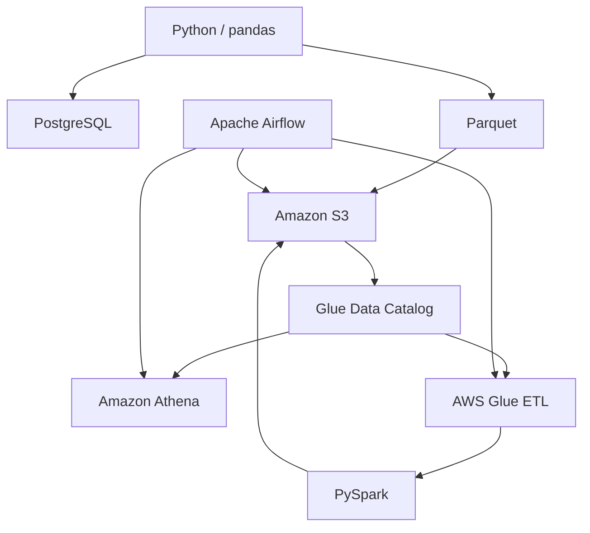

# Learning Roadmap

このドキュメントでは、`data-engineering-study` で実施した
データエンジニアリング学習の進行内容をPhaseごとに整理します。

---

## Phase 1-4: ETL Fundamentals

### Topics

- Pythonによるデータ処理
- Docker / Docker Compose
- PostgreSQL
- Extract / Transform / Load
- Data Validation
- UPSERT
- pytest

### Implementation

CSVデータを読み込み、変換後にPostgreSQLへ保存する
基本的なETLパイプラインを実装しました。

```text
CSV
 ↓
Extract
 ↓
Transform
 ↓
Load
 ↓
PostgreSQL
```

処理を以下の責務に分離しています。

```text
extract/
transform/
load/
```

Transformでは、

- 必須Column確認
- 重複チェック
- 数値チェック
- 負数チェック
- 日付変換
- season生成

などのValidationを実装しました。

PostgreSQLへのLoadではUPSERTを利用し、
複数回実行してもデータが重複しない
冪等性について学びました。

### Learned

- ETLとELTの違い
- Extract / Transform / Loadの責務分離
- Data Validation
- Idempotency
- Unit Test
- Dockerを利用したローカルDB環境構築

---

## Phase 5-7: Parquet / Partition / Pruning

### Topics

- Apache Parquet
- PyArrow
- Columnar Storage
- Partition
- Partition Pruning
- Column Pruning
- Performance Benchmark

### Implementation

CSVからParquetへデータを変換しました。

```text
CSV
 ↓
pandas
 ↓
Parquet
```

さらに `season` 単位でHive形式のPartitionを作成しました。

```text
matches/
├── season=2022/
├── season=2023/
├── season=2024/
├── season=2025/
└── season=2026/
```

大量データを生成し、CSVとParquetの読み込み性能も比較しました。

### Learned

- Row-oriented / Column-oriented Storageの違い
- ParquetのColumnar Storage
- 圧縮とSchema保持
- Partitionによる物理的なデータ分割
- Partition Pruning
- Column Pruning
- 必要なデータだけ読むことの重要性

---

## Phase 8-11: Amazon S3 / Data Lake / boto3

### Topics

- Amazon S3
- Data Lake
- AWS CLI
- boto3
- S3 Upload
- Dependency Injection
- Mock Test

### Implementation

ローカルのETL処理をAmazon S3へ拡張しました。

```text
Local CSV
    ↓
S3 raw
    ↓
Python ETL
    ↓
Parquet
    ↓
S3 processed
```

S3では、

```text
raw/
processed/
```

を分離し、加工前・加工後のデータを管理しました。

boto3のS3 Clientを処理内部で直接生成せず、
外部から注入するDependency Injectionも導入しました。

```text
Caller
 ↓
boto3 client
 ↓
upload function
```

Unit TestではMock Clientを利用し、
AWSへ実際に接続せずS3 Upload処理を検証しました。

### Learned

- S3をData Lakeとして利用する考え方
- raw / processedの分離
- boto3によるAWS API操作
- Dependency Injection
- Mockを利用した外部サービスのテスト
- ローカル処理とCloud Storageの接続

---

## Phase 12: AWS Glue Data Catalog / Amazon Athena

### Topics

- AWS Glue Crawler
- Glue Data Catalog
- Amazon Athena
- Partition Metadata
- Partition Pruning
- Column Pruning

### Implementation

S3上のParquetデータをGlue Crawlerで解析し、
Glue Data CatalogへTableとして登録しました。

```text
Amazon S3
    ↓
Glue Crawler
    ↓
Glue Data Catalog
    ↓
Amazon Athena
```

AthenaからSQLを実行し、
S3上のParquetを直接分析しました。

Partition Keyには `season` を使用しています。

```sql
SELECT SUM(home_goals)
FROM matches
WHERE season = '2026';
```

Partitionを指定した場合と指定しない場合で
AthenaのScan量を比較しました。

### Learned

- Data Catalogはデータ本体ではなくMetadataを管理する
- Glue Crawlerの役割
- AthenaはServerless Query Engine
- Partition PruningによるScan量削減
- Column PruningによるScan量削減
- ParquetとAthenaの相性

---

## Phase 13: AWS Glue ETL / PySpark

### Topics

- AWS Glue ETL Job
- Apache Spark
- PySpark
- Distributed Processing
- Serverless ETL
- push_down_predicate

### Implementation

Glue Data Catalog上のデータを
AWS Glue ETL Jobから読み込み、
PySparkで集計しました。

```text
Glue Data Catalog
      ↓
AWS Glue ETL
      ↓
PySpark
      ↓
groupBy / aggregate
      ↓
Amazon S3
```

Glue Jobへ実行時パラメータとして、

```text
SOURCE_DATABASE
SOURCE_TABLE
SEASON
OUTPUT_PATH
```

を渡し、同一Jobを異なる対象データに再利用できるようにしました。

### Learned

- SparkとPySparkの関係
- 分散データ処理
- Glue ETL Jobの役割
- Serverlessの意味
- AthenaとGlue ETLの役割の違い
- Partition Pushdown
- 大規模データ処理の考え方

---

## Phase 14: Apache Airflow Fundamentals

### Topics

- Apache Airflow
- DAG
- Task
- Task Dependency
- TaskFlow API
- XCom
- Docker Compose

### Implementation

AirflowをDocker Composeでローカル起動し、
基本的なETL DAGを作成しました。

```text
extract
  ↓
transform
  ↓
load
```

TaskFlow APIを使用してTaskを定義し、
Task間の戻り値をXComで受け渡しました。

### Learned

- AirflowはData Processing Engineではない
- Workflow Orchestration
- DAG
- Task
- Task Dependency
- XCom
- Airflow UI
- Task Log

---

## Phase 15: Airflow → AWS Glue

### Topics

- GlueJobOperator
- Airflow Amazon Provider
- AWS Authentication
- XCom
- Job Monitoring

### Implementation

Phase 13で手動実行していたGlue Jobを
Airflowから起動できるようにしました。

```text
Airflow
   ↓
GlueJobOperator
   ↓
AWS Glue ETL
   ↓
PySpark
   ↓
Amazon S3
   ↓
Airflowが完了を検知
```

Glue JobのRun IDをXComで後続Taskへ渡しました。

### Troubleshooting

AWS認証では以下の問題も経験しました。

```text
~/.aws read-only mount
        ↓
Credential refresh failure
```

および、

```text
aws login session expired
        ↓
CreateOAuth2Token ValidationException
```

それぞれ原因を切り分け、
Airflow ContainerからAWS STSへ接続できる状態を確認しました。

### Learned

- AirflowからAWS Serviceを制御する方法
- GlueJobOperator
- AWS Credentialの実行環境依存
- Temporary Credential
- Job completion monitoring
- XComによるJob ID受け渡し

---

## Phase 16: Airflow → S3 → Glue → Athena

### Topics

- S3KeySensor
- GlueJobOperator
- AthenaOperator
- Workflow Dependency
- Data Validation
- End-to-End Pipeline

### Implementation

Airflowから複数AWSサービスを連携した
データパイプラインを構築しました。

```text
S3KeySensor
      ↓
GlueJobOperator
      ↓
AWS Glue / PySpark
      ↓
Amazon S3
      ↓
AthenaOperator
      ↓
Validation Task
```

具体的なTask構成：

```text
wait_for_source
       ↓
run_matches_summary_glue_job
       ↓
create_summary_table
       ↓
register_partition
       ↓
validate_summary
       ↓
check_validation_result
```

S3KeySensorで入力ファイルの存在を確認し、
Glue Jobを実行後、
Athenaから結果をQueryしてValidationを行いました。

AthenaのQuery Execution IDはXComを利用して
後続Taskへ渡しています。

### Learned

- OperatorとSensorの違い
- 外部データ到着待機
- ETLとQuery Engineの連携
- AirflowによるEnd-to-End Orchestration
- Athena Query Resultの後続Task利用
- Task間で大容量データではなくMetadataを渡す設計

---

## Phase 17: Airflow Operations / Schedule / Retry / Failure Handling / Backfill

### Topics
- Schedule
- Data Interval
- Logical Date
- Retry
- Failure Handling
- Backfill
- XCom

### Implementation

手動で1回実行していたDAGを、定期実行できるようにしました。

処理中に予期せぬ一時的な障害が発生した場合は、リトライを最大2回実施するようになっています。

ただし、以下のバリデーションルールでエラーになった場合は、リトライ対象外としています。

バリデーションルール
- 対象とするデータ期間の開始日時が終了日時より未来日である場合エラー

Airflow UIからの手動実行は引き続き行えますが、

同じDAGを同時実行しないように制御しています。

Backfillを利用して、指定した過去期間のDAG Runを再処理できることを確認しました。

Dry Run で実行するDAGを確認
```
docker compose exec airflow-scheduler \
  airflow backfill create \
  --dag-id airflow_operations_dag \
  --from-date "2026-08-20T00:00:00+09:00" \
  --to-date "2026-08-22T23:59:59+09:00" \
  --reprocess-behavior none \
  --dry-run
```

実行後の出力例
```
Runs to be attempted:
+---------------------------+-----------------+------------------+
| logical_date              | partition_key   | partition_date   |
+===========================+=================+==================+
| 2026-08-19 17:00:00+00:00 |                 |                  |
+---------------------------+-----------------+------------------+
| 2026-08-20 17:00:00+00:00 |                 |                  |
+---------------------------+-----------------+------------------+
| 2026-08-21 17:00:00+00:00 |                 |                  |
+---------------------------+-----------------+------------------+
```

確認出来たら実際に実行

```
docker compose exec airflow-scheduler \
  airflow backfill create \
  --dag-id airflow_operations_dag \
  --from-date "2026-08-20T00:00:00+09:00" \
  --to-date "2026-08-22T23:59:59+09:00" \
  --reprocess-behavior none \
  --max-active-runs 1
```

`max_active_runs=1` で同時に大量実行しないようにしています。

```
8/20
 ↓
完了
 ↓
8/21
 ↓
完了
 ↓
8/22
```

### Learned

- DAGの定期実行
- catchup=False により過去のスケジュール分が自動実行されないように制御
- 一時的な障害に対応するリトライ処理を導入
- 指定した過去期間をBackfillで手動実行
- Data IntervalがDAG Runの処理対象期間を表すことを理解
- Logical Dateと実際の実行日時が必ずしも一致しないことを理解

---

# Current Learning Architecture

Phase 1からPhase 17までで、
以下の技術を段階的につなげました。



---

# Key Concepts Learned

## Data Engineering

- ETL / ELT
- Data Validation
- Idempotency
- Data Lake
- Columnar Storage
- Partitioning
- Partition Pruning
- Column Pruning

## Data Processing

- pandas
- PyArrow
- Apache Spark
- PySpark
- Distributed Processing

## AWS

- Amazon S3
- AWS Glue Crawler
- AWS Glue Data Catalog
- AWS Glue ETL
- Amazon Athena
- AWS IAM
- boto3

## Workflow Orchestration

- Apache Airflow
- DAG
- Task
- Operator
- Sensor
- XCom
- Task Dependency

## Software Engineering

- Separation of Concerns
- Dependency Injection
- Unit Test
- Mock
- Docker / Docker Compose

---

# Next Steps

今後は、構築したデータパイプラインを
より実運用に近づける内容を学習します。

主な候補：

- Monitoring
- Alerting
- Backfill
- Data Quality
- Pipeline Parameterization
- Production-oriented Airflow Architecture
